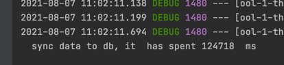
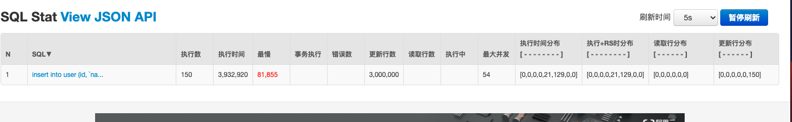

模拟出300万的数量插入数据库，主要思想是通过线程池和atomic来实现，借鉴分片思维。
先快速过基本的配置。
#### 数据库
```sql
/*
 Navicat Premium Data Transfer

 Source Server         :
 Source Server Type    : MySQL
 Source Server Version : 50735
 Source Host           : :3306
 Source Schema         : high_concurrency

 Target Server Type    : MySQL
 Target Server Version : 50735
 File Encoding         : 65001

 Date: 07/08/2021 10:52:33
*/

SET NAMES utf8mb4;
SET FOREIGN_KEY_CHECKS = 0;

-- ----------------------------
-- Table structure for user
-- ----------------------------
DROP TABLE IF EXISTS `user`;
CREATE TABLE `user` (
  `id` int(11) NOT NULL,
  `name` varchar(45) DEFAULT NULL,
  `createdTime` timestamp NULL DEFAULT CURRENT_TIMESTAMP ON UPDATE CURRENT_TIMESTAMP,
  `updatedTime` timestamp NULL DEFAULT CURRENT_TIMESTAMP,
  PRIMARY KEY (`id`),
  KEY `index` (`id`)
) ENGINE=InnoDB DEFAULT CHARSET=utf8mb4 COMMENT='用户测试表';

SET FOREIGN_KEY_CHECKS = 1;

```
#### pom.xml

```xml
<?xml version="1.0" encoding="UTF-8"?>
<project xmlns="http://maven.apache.org/POM/4.0.0" xmlns:xsi="http://www.w3.org/2001/XMLSchema-instance"
         xsi:schemaLocation="http://maven.apache.org/POM/4.0.0 https://maven.apache.org/xsd/maven-4.0.0.xsd">
    <modelVersion>4.0.0</modelVersion>
    <parent>
        <groupId>org.springframework.boot</groupId>
        <artifactId>spring-boot-starter-parent</artifactId>
        <version>2.5.3</version>
        <relativePath/> <!-- lookup parent from repository -->
    </parent>
    <groupId>com.concurrency</groupId>
    <artifactId>currency01</artifactId>
    <version>0.0.1-SNAPSHOT</version>
    <name>currency01</name>
    <description>Demo project for Spring Boot</description>
    <properties>
        <java.version>1.8</java.version>
    </properties>
    <dependencies>
        <dependency>
            <groupId>org.springframework.boot</groupId>
            <artifactId>spring-boot-starter-data-jdbc</artifactId>
        </dependency>
        <dependency>
            <groupId>org.springframework.boot</groupId>
            <artifactId>spring-boot-starter-data-redis</artifactId>
        </dependency>
        <dependency>
            <groupId>org.springframework.boot</groupId>
            <artifactId>spring-boot-starter-jdbc</artifactId>
        </dependency>
        <dependency>
            <groupId>org.springframework.boot</groupId>
            <artifactId>spring-boot-starter-web</artifactId>
        </dependency>
        <dependency>
            <groupId>org.mybatis.spring.boot</groupId>
            <artifactId>mybatis-spring-boot-starter</artifactId>
            <version>2.2.0</version>
        </dependency>

        <dependency>
            <groupId>org.springframework.boot</groupId>
            <artifactId>spring-boot-devtools</artifactId>
            <scope>runtime</scope>
            <optional>true</optional>
        </dependency>
        <dependency>
            <groupId>mysql</groupId>
            <artifactId>mysql-connector-java</artifactId>
            <scope>runtime</scope>
        </dependency>
        <dependency>
            <groupId>org.projectlombok</groupId>
            <artifactId>lombok</artifactId>
            <optional>true</optional>
        </dependency>
        <dependency>
            <groupId>org.springframework.boot</groupId>
            <artifactId>spring-boot-starter-test</artifactId>
            <scope>test</scope>
        </dependency>
        <!-- Druid -->
        <dependency>
            <groupId>com.alibaba</groupId>
            <artifactId>druid-spring-boot-starter</artifactId>
            <version>1.1.10</version>
        </dependency>
    </dependencies>

    <build>
        <plugins>
            <plugin>
                <groupId>org.springframework.boot</groupId>
                <artifactId>spring-boot-maven-plugin</artifactId>
                <configuration>
                    <excludes>
                        <exclude>
                            <groupId>org.projectlombok</groupId>
                            <artifactId>lombok</artifactId>
                        </exclude>
                    </excludes>
                </configuration>
            </plugin>
        </plugins>
    </build>

</project>

```
#### application.yml(*其中数据库密码和ip自己配置*)
```yml
server:
  port: 8080
mybatis:
  mapper-locations: classpath:mapper/*Mapper.xml
logging:
  level:
    com.concurrency.currency01.mapper: debug

spring:
  # 数据源配置
  datasource:
    driver-class-name: com.mysql.cj.jdbc.Driver
    url: jdbc:mysql://xxxx:3306/high_concurrency?serverTimezone=GMT%2B8&useUnicode=true&characterEncoding=UTF-8&autoReconnect=true
    username: root
    password: xxx
    type: com.alibaba.druid.pool.DruidDataSource
    platform: mysql
    # 连接池配置
    druid:
      # 初始化大小，最小，最大
      initial-size: 5
      max-active: 100
      min-idle: 1
      # 配置获取连接等待超时的时间
      max-wait: 60000
      # 配置间隔多久才进行一次检测，检测需要关闭的空闲连接，单位毫秒
      time-between-eviction-runs-millis: 60000
      # 配置一个连接在池中最小生存时间
      min-evictable-idle-time-millis: 300000
      # 用来检测连接是否有效的sql 必须是一个查询语句 注意没有此语句以下三个属性不会生效
      validation-query: SELECT 1 FROM DUAL
      # 归还连接时会执行validationQuery检测连接是否有效,开启会降低性能,默认为true
      test-on-return: false
      # 申请连接时会执行validationQuery检测连接是否有效,开启会降低性能,默认为true
      test-on-borrow: true
      # 申请连接的时候检测，如果空闲时间大于timeBetweenEvictionRunsMillis，执行validationQuery检测连接是否有效。
      test-while-idle: true
      # 配置监控统计拦截的 Filter，去掉后监控界面 SQL 无法统计，wall 用于防火墙
      filters: stat,wall
      # 通过 connection-properties 属性打开 mergeSql 功能；慢 SQL 记录
      connection-properties: druid.stat.mergeSql\=true;druid.stat.slowSqlMillis\=5000
      # 配置 DruidStatFilter
      web-stat-filter:
        enabled: true
        url-pattern: /*
        exclusions: .js,*.gif,*.jpg,*.bmp,*.png,*.css,*.ico,/druid/*
      # 配置 DruidStatViewServlet
      stat-view-servlet:
        url-pattern: /druid/*
        # IP 白名单，没有配置或者为空，则允许所有访问
        #allow: 127.0.0.1
        # IP 黑名单，若白名单也存在，则优先使用
        #deny: 192.168.31.253
        # 禁用 HTML 中 Reset All 按钮
        reset-enable: true
        # 登录用户名/密码
        login-username: root
        login-password: 123456
        # 注意 此处必须开启，否则无法访问druid监控面板
        enabled: true
      use-global-data-source-stat: true

```
#### 用户实体类
```java
package com.concurrency.currency01.domain;

import java.util.Date;
import lombok.AllArgsConstructor;
import lombok.Data;
import lombok.NoArgsConstructor;

/**
    * 用户测试表
    */
@Data
@AllArgsConstructor
@NoArgsConstructor
public class User {
    private Integer id;

    private String name;

    private Date createdtime;

    private Date updatedtime;
}
```
#### usermapper
```java
package com.concurrency.currency01.mapper;

import com.concurrency.currency01.domain.User;

import java.util.List;

public interface UserMapper {
    int deleteByPrimaryKey(Integer id);

    int insert(User record);

    int insertSelective(User record);

    User selectByPrimaryKey(Integer id);

    int updateByPrimaryKeySelective(User record);

    int updateByPrimaryKey(User record);

    int batchSave(List list);

}
```
usermapper.xml

```xml
<?xml version="1.0" encoding="UTF-8"?>
<!DOCTYPE mapper PUBLIC "-//mybatis.org//DTD Mapper 3.0//EN" "http://mybatis.org/dtd/mybatis-3-mapper.dtd">
<mapper namespace="com.concurrency.currency01.mapper.UserMapper">
  <resultMap id="BaseResultMap" type="com.concurrency.currency01.domain.User">
    <!--@mbg.generated-->
    <!--@Table `user`-->
    <id column="id" jdbcType="INTEGER" property="id" />
    <result column="name" jdbcType="VARCHAR" property="name" />
    <result column="createdTime" jdbcType="TIMESTAMP" property="createdtime" />
    <result column="updatedTime" jdbcType="TIMESTAMP" property="updatedtime" />
  </resultMap>
  <sql id="Base_Column_List">
    <!--@mbg.generated-->
    id, `name`, createdTime, updatedTime
  </sql>
  <select id="selectByPrimaryKey" parameterType="java.lang.Integer" resultMap="BaseResultMap">
    <!--@mbg.generated-->
    select 
    <include refid="Base_Column_List" />
    from `user`
    where id = #{id,jdbcType=INTEGER}
  </select>
  <delete id="deleteByPrimaryKey" parameterType="java.lang.Integer">
    <!--@mbg.generated-->
    delete from `user`
    where id = #{id,jdbcType=INTEGER}
  </delete>
  <insert id="insert" parameterType="com.concurrency.currency01.domain.User">
    <!--@mbg.generated-->
    insert into `user` (id, `name`, createdTime, 
      updatedTime)
    values (#{id,jdbcType=INTEGER}, #{name,jdbcType=VARCHAR}, #{createdtime,jdbcType=TIMESTAMP}, 
      #{updatedtime,jdbcType=TIMESTAMP})
  </insert>
  <insert id="insertSelective" parameterType="com.concurrency.currency01.domain.User">
    <!--@mbg.generated-->
    insert into `user`
    <trim prefix="(" suffix=")" suffixOverrides=",">
      <if test="id != null">
        id,
      </if>
      <if test="name != null">
        `name`,
      </if>
      <if test="createdtime != null">
        createdTime,
      </if>
      <if test="updatedtime != null">
        updatedTime,
      </if>
    </trim>
    <trim prefix="values (" suffix=")" suffixOverrides=",">
      <if test="id != null">
        #{id,jdbcType=INTEGER},
      </if>
      <if test="name != null">
        #{name,jdbcType=VARCHAR},
      </if>
      <if test="createdtime != null">
        #{createdtime,jdbcType=TIMESTAMP},
      </if>
      <if test="updatedtime != null">
        #{updatedtime,jdbcType=TIMESTAMP},
      </if>
    </trim>
  </insert>
  <update id="updateByPrimaryKeySelective" parameterType="com.concurrency.currency01.domain.User">
    <!--@mbg.generated-->
    update `user`
    <set>
      <if test="name != null">
        `name` = #{name,jdbcType=VARCHAR},
      </if>
      <if test="createdtime != null">
        createdTime = #{createdtime,jdbcType=TIMESTAMP},
      </if>
      <if test="updatedtime != null">
        updatedTime = #{updatedtime,jdbcType=TIMESTAMP},
      </if>
    </set>
    where id = #{id,jdbcType=INTEGER}
  </update>
  <update id="updateByPrimaryKey" parameterType="com.concurrency.currency01.domain.User">
    <!--@mbg.generated-->
    update `user`
    set `name` = #{name,jdbcType=VARCHAR},
      createdTime = #{createdtime,jdbcType=TIMESTAMP},
      updatedTime = #{updatedtime,jdbcType=TIMESTAMP}
    where id = #{id,jdbcType=INTEGER}
  </update>

  <insert id="batchSave">
    insert into user (id, `name`) values
      <foreach collection="list" item="item" index="index" separator=",">
         (#{item.id,jdbcType=INTEGER}, #{item.name,jdbcType=VARCHAR} )
    </foreach>

  </insert>

</mapper>
```

#### 用户控制层

```java
package com.concurrency.currency01.controller;

import com.concurrency.currency01.service.UserService;
import org.springframework.beans.factory.annotation.Autowired;
import org.springframework.web.bind.annotation.PostMapping;
import org.springframework.web.bind.annotation.RestController;

@RestController
public class UserController {
    @Autowired
    private UserService userService;

    @PostMapping("/insert")
    public String ok() {
        return userService.hanlder();
    }
}

```

接下来是最核心的代码
这里借鉴分片思想，将三百万的数据按每次分片20000条数据进行插入，首先开启100的定长线程池，
```java
ExecutorService pool = Executors.newFixedThreadPool(100);
```
通过runnable，存入20000条数据，由atomic计算插入的数量，最后通过执行线程池的命令进行数据插入
```java
 atomicInt.addAndGet( userMapper.batchSave(userList));
```
```
pool.execute(run);
```


```java
package com.concurrency.currency01.service.impl;

import com.concurrency.currency01.domain.User;
import com.concurrency.currency01.mapper.UserMapper;
import com.concurrency.currency01.service.UserService;
import org.springframework.beans.factory.annotation.Autowired;
import org.springframework.stereotype.Service;

import java.util.ArrayList;
import java.util.List;
import java.util.concurrent.ExecutorService;
import java.util.concurrent.Executors;
import java.util.concurrent.atomic.AtomicInteger;

@Service
public class UserServiceImpl implements UserService {
    @Autowired
    private UserMapper userMapper;
    /**
     * 百万数据插入
     * @return
     */
    @Override
    public String hanlder() {
        ExecutorService pool = Executors.newFixedThreadPool(100);
        int totalPageNo = 150;
        int pageSize = 20000;
        long start = System.currentTimeMillis();
        AtomicInteger atomicInt = new AtomicInteger();
        for(int currentPageNo = 0; currentPageNo < totalPageNo; currentPageNo++){
           int finalCurrentPageNo = currentPageNo;
          Runnable run = new Runnable() {
             @Override
             public void run() {
               List userList=new ArrayList<>();
               for(int i=1;i<=pageSize;i++){
                 int id=i+ finalCurrentPageNo *pageSize;
                 User user =new User();
                 user.setId(id);
                 user.setName("zhouzhou:"+id);
                 userList.add(user);
               }
               atomicInt.addAndGet( userMapper.batchSave(userList));
               if(atomicInt.get() ==(totalPageNo*pageSize)){
                    System.out.println("  sync data to db, it  has spent " +(System.currentTimeMillis()-start)+"  ms");
               }
             }
          };
          try {
              Thread.sleep(5);
          } catch (InterruptedException e) {
              e.printStackTrace();
          }
          pool.execute(run);
        }
        return  "ok";
    }
}


结果如下：

